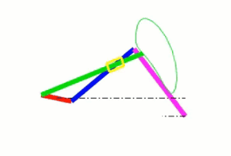

# A-six-bar-linkage-mechanism-
Animating the mechanism of a 6-bar linkage and plotting its Position-Analysis-Diagram using MATLAB

### About the project
The objective of this project was to apply the concept of Homogenous Transformation Matrices(HTM) in order to obtain the position analysis plot for a sample 6-bar-mechanism, dynamically with a little bit of code. Since the Degree of freedom here is 1, there is only one independent parameter, i.e the theta value or angle of inclination of the 'link 2', the driver link. By changing theta we can determine how the mechanism will change its orientation with respect to different input angles of inclination. HTMs can also be used to create an animation of the mechanical movements of the linkage, at the joints as well as for the slider. 

Here's a quick preview!

### Brief description of the mechanism
A four bar linkage is connected in parallel with an inverted slider crank mechanism, forming a kinematic chain. Different coupler curves can be obtained by simply changing the geometric lengths of the individual links that form the mechanism.

### Repository Structure
* Helper funtions
  * Slider_Shape.m 
  * Circle_Circle_Intersection
* ReadMe_Img
* Results (Screenshots and Animation video)
  * Position Diagram - Different angles of inclination (degrees)
    * Theta = 0
    * Theta = 60
  * Different coupler shapes obtained by changing the dimensions of links
  * Animation of the mechanism
* Source Code
  * SixBarLinkage_Animation.m
  * Position_diagram.m
* README
